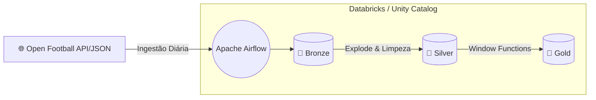

# ⚽ Pipeline de Dados: Eficiência Emocional no Futebol

Este repositório contém o Trabalho Final do MBA em Engenharia de Dados. O projeto consiste em um pipeline ponta a ponta que extrai dados históricos de futebol e aplica regras de negócio complexas para analisar o comportamento psicológico e tático das equipes durante as partidas.

---

## 🏗️ Arquitetura do Projeto

O pipeline foi desenhado utilizando a **Arquitetura Medalhão** (Bronze, Silver e Gold) e preparado para orquestração moderna. 

Abaixo está o fluxo conceitual de como os dados trafegam desde a fonte até a camada final de análise (Gold) na nuvem:



### O Papel de Cada Componente:
1. **API / Fonte JSON**: Repositórios do *Open Football Data* fornecendo dados históricos estruturados de Copas do Mundo e Eurocopas.
2. **Apache Airflow (Orquestrador)**: Ferramenta responsável por agendar e disparar os pipelines na ordem correta, garantindo o fluxo incremental e contínuo.
3. **Camada Bronze (Ingestão)**: Download bruto dos dados e criação das tabelas particionadas no formato Delta.
4. **Camada Silver (Normalização)**: Extração das listas de gols (`explode()`) para criar uma linha do tempo precisa e baseada em eventos.
5. **Camada Gold (Negócio)**: Uso de Funções de Janela do PySpark para gerar a tabela analítica final, calculando a Eficiência Emocional (Tempo de Reação x Tempo de Apagão).

---

## 🎯 A Pergunta de Negócio

> *"Qual é o impacto real no desempenho e postura tática dos times logo após sofrerem um gol?"*

Nosso modelo de dados responde a isso na Camada Gold calculando:
- **Resiliência:** Quanto tempo, em média, a equipe leva para empatar o jogo após sofrer o primeiro gol.
- **Vulnerabilidade:** Qual é a probabilidade e o tempo médio para a equipe sofrer um *segundo* gol em sequência (Efeito Dominó).

---

## 🚀 Como Executar no Databricks Cloud

Este projeto é Agnóstico de Plataforma e foi otimizado para a nuvem utilizando a funcionalidade *Databricks Repos*.

1. Conecte seu **Databricks Repos** a este repositório do GitHub.
2. Abra o primeiro notebook (`01_Pipeline_Football_Bronze.ipynb`).
3. Certifique-se de que a variável de ambiente está apontando para a nuvem:
   ```python
   ENVIRONMENT = "databricks"
   ```
4. Em um ambiente de produção real, o **Airflow** orquestraria a chamada sequencial dos notebooks. Para execução manual no Databricks, basta abrir os notebooks de 01 a 03 em ordem cronológica e executar todas as células.
