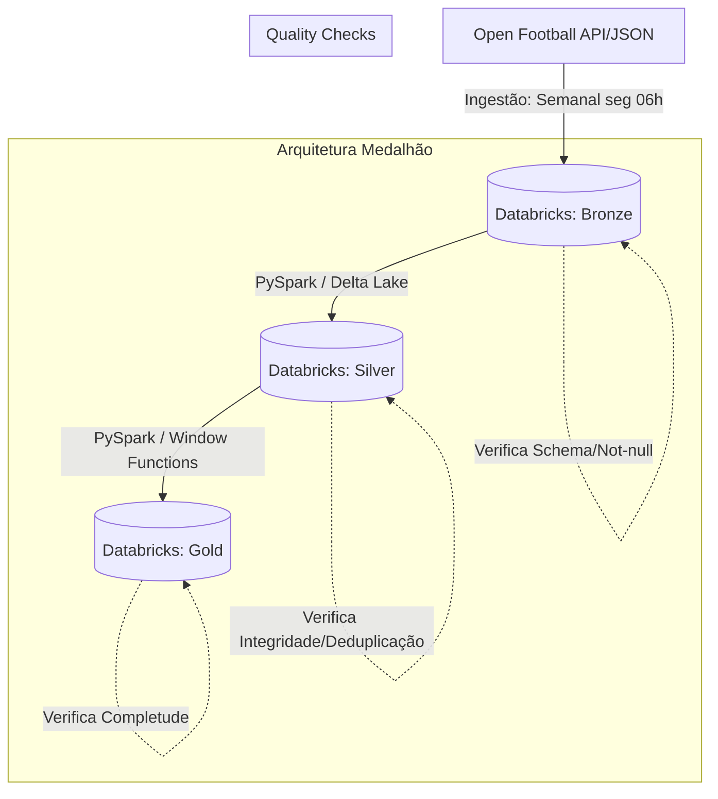

# ⚽ Pipeline de Dados: Eficiência Emocional no Futebol

Este repositório contém o Trabalho Final do MBA em Engenharia de Dados. O projeto consiste em um pipeline ponta a ponta que extrai dados históricos de futebol e aplica regras de negócio complexas para analisar o comportamento psicológico e tático das equipes durante as partidas.

---

## 🏗️ Arquitetura do Projeto

O pipeline foi desenhado utilizando a **Arquitetura Medalhão** (Bronze, Silver e Gold) e atende estritamente às especificações definidas no documento arquitetural base (`ARCHITECTURE.md`).

Abaixo está o fluxo conceitual de como os dados trafegam:



### O Papel de Cada Camada:
1. **Frequência de Execução**: Conforme definido na arquitetura, o fluxo ocorre semanalmente (toda segunda às 06h UTC) durante a temporada, ou mensalmente durante os recessos (jun-jul). A orquestração se dá nativamente via **Databricks Workflows**.
2. **Camada Bronze (Ingestão)**: Download bruto dos arquivos JSON (sem transformação) e armazenamento no Unity Catalog, aplicando verificações iniciais de qualidade.
3. **Camada Silver (Normalização)**: Aplicação de transformações (como `explode()` para criar a linha do tempo de gols) garantindo dados limpos, normalizados e enriquecidos no formato Delta.
4. **Camada Gold (Negócio)**: Geração de métricas prontas para consumo utilizando PySpark e SQL, como o percentual de equipes que reagem após sofrer um gol.

---

## 🎯 A Pergunta de Negócio

> *"Qual é o impacto real no desempenho e postura tática dos times logo após sofrerem um gol?"*

Nossa Camada Gold responde diretamente a isso analisando:
- A proporção de times que reagem (empate/virada) após sofrerem um gol.
- Como esse padrão de comportamento (resiliência x vulnerabilidade) varia de acordo com a seleção ou torneio.

---

## 🚀 Como Executar no Databricks Cloud

Este projeto foi desenhado sob as premissas do *Databricks Workflow* integrado ao *Unity Catalog*.

1. Conecte seu **Databricks Repos** a este repositório do GitHub.
2. Certifique-se de que a variável de ambiente nos notebooks está apontando para a nuvem:
   ```python
   ENVIRONMENT = "databricks"
   ```
3. O projeto é executado de forma sequencial (Bronze → Silver → Gold). Para rodar manualmente:
   - Abra o notebook `01_Pipeline_Football_Bronze.ipynb` e execute tudo.
   - Abra o notebook `02_Pipeline_Football_Silver.ipynb` e execute tudo.
   - Abra o notebook `03_Pipeline_Football_Gold.ipynb` e execute tudo.
